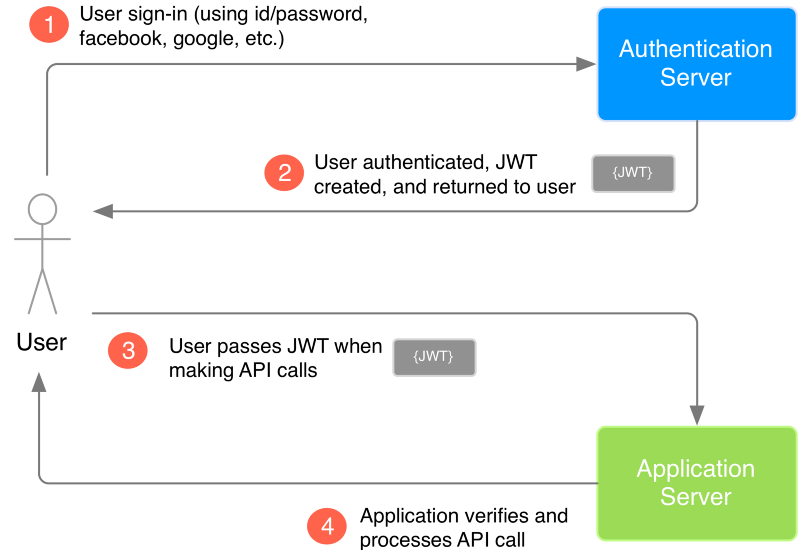

# An attempt at Angular 2

Based on [angular.io tutorial](https://angular.io/tutorial)

An experimental project to learn Angular 2 and jwt.

## How JSON Web Tokens (JWT) are used

Image from <https://medium.com/vandium-software/5-easy-steps-to-understanding-json-web-tokens-jwt-1164c0adfcec>

## login

Based on <http://angularjs.blogspot.no/2016/11/easy-angular-authentication-with-json.html>

## guard

Based on <https://github.com/auth0-blog/angular2-tour-of-heroes>

## Tests

Based on <https://semaphoreci.com/community/tutorials/a-tdd-approach-to-building-a-todo-api-using-node-js-and-mongodb>
